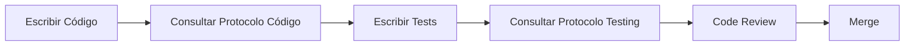
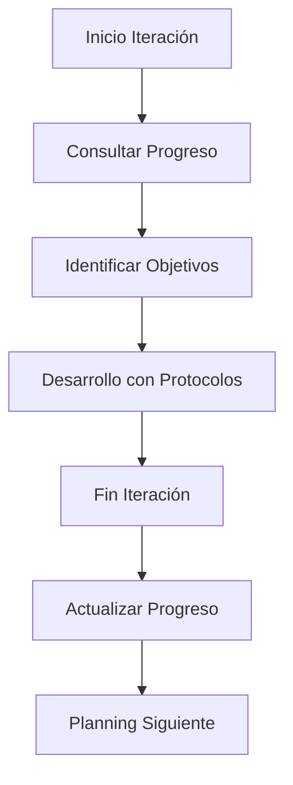

# 📚 ÍNDICE DE PROTOCOLOS - DamianApp

## 🎯 **Propósito de los Protocolos**
Conjunto de estándares y procesos para mantener la **máxima calidad** en el desarrollo de DamianApp.

---

## 📁 **Estructura de Protocolos**

### **🏗️ Protocolos Fijos (No Editar)**
> Estos protocolos definen estándares permanentes que todo el equipo debe seguir.

#### **📘 [PROTOCOLO_CALIDAD_CODIGO.md](./PROTOCOLO_CALIDAD_CODIGO.md)**
- **Propósito:** Estándares inmutables de calidad de código
- **Aplica a:** Todo el código de producción
- **Principios:** SOLID, Clean Code, Arquitectura, Seguridad
- **Uso:** Consultar antes de cada PR, en code review
- **Scope:** NO incluye testing (ver protocolo específico abajo)

#### **🧪 [PROTOCOLO_CALIDAD_TESTING.md](./PROTOCOLO_CALIDAD_TESTING.md)**
- **Propósito:** Estándares inmutables de testing
- **Aplica a:** Todos los tests unitarios e integración
- **Principios:** F.I.R.S.T., SOLID Testing, A.A.A., Mocking
- **Uso:** Consultar antes de escribir tests
- **Scope:** Cobertura completa de testing (no duplicado en protocolo de código)

### **📊 Protocolos Dinámicos (Editable por Iteración)**
> Estos protocolos se actualizan con cada iteración para trackear progreso.

#### **📊 [PROTOCOLO_AUDITORIA_PROGRESO.md](./PROTOCOLO_AUDITORIA_PROGRESO.md)**
- **Propósito:** Trackear progreso, problemas y métricas
- **Aplica a:** Gestión de calidad del proyecto
- **Actualización:** Al final de cada iteración
- **Uso:** Planning, retrospectivas, dashboard

---

---

## 🔄 **Flujo de Trabajo con Protocolos**

### **1. Desarrollo Diario**


### **2. Gestión de Iteraciones**


---

## 📊 **Métricas Cruzadas**

### **Dashboard Unificado**
Los 3 protocolos alimentan un dashboard común:

```
CALIDAD GENERAL DAMIANAPP
┌─────────────────────────────────────┐
│                                     │
│ 📘 Código:    58% ███████░░░         │
│ 🧪 Testing:   62% ████████░░         │
│ 📊 Progreso:  77% ████████████░      │
│                                     │
│ 🎯 Meta Global: 85%                 │
│ 📅 ETA: 2 iteraciones               │
│                                     │
└─────────────────────────────────────┘
```

---

## ✅ **Checklist de Uso**

### **Para Desarrolladores**
- [ ] 📘 ¿Conozco el protocolo de calidad de código?
- [ ] 🧪 ¿Conozco el protocolo de testing?
- [ ]  ¿Reviso el progreso periódicamente?

### **Para Project Managers**
- [ ] 📊 ¿Actualizo el protocolo de progreso cada iteración?
- [ ] 📈 ¿Monitoreo las métricas de calidad?
- [ ] 🎯 ¿Establezco objetivos claros por iteración?
- [ ] 🔄 ¿Reviso y ajusto procesos basado en learnings?

### **Para Code Reviews**
- [ ] 📘 ¿El código sigue el protocolo de calidad?
- [ ] 🧪 ¿Los tests siguen el protocolo de testing?
- [ ]  ¿Se actualiza el progreso si es necesario?

---

## 🚀 **Beneficios de esta Estructura**

### **🎯 Claridad de Propósito**
- **Código y Testing:** Estándares fijos que todos siguen
- **Progreso:** Visibilidad clara del avance y problemas

### **🔄 Flexibilidad Apropiada**
- **Fijos:** Aseguran calidad constante
- **Dinámicos:** Se adaptan a realidad del proyecto
- **Separados:** No hay conflicto entre propósitos

### **📈 Mejora Continua**
- **Métricas:** Trackeo objetivo del progreso
- **Learnings:** Captura de decisiones y razones
- **Iteración:** Mejora basada en datos reales

---

## 📝 **Convenciones de Actualización**

### **Protocolos Fijos**
- ❌ **NO editar** sin consenso del equipo completo
- ✅ Solo cambios por razones arquitecturales mayores
- 📅 Revisión semestral para mejoras

### **Protocolo de Progreso**
- ✅ **Editar libremente** cada iteración
- 📊 Actualizar métricas regularmente
- 🎯 Ajustar objetivos según capacidad real

---

## 🔗 **Links Útiles**

- 📚 [Documentación General](../README.md)
- � [Configuración del Proyecto](../package.json)
- 🔧 [Configuración ESLint](../eslint.config.js)
- 🎨 [Configuración Prettier](../prettier.config.js)

---

**🎯 Meta:** Estos protocolos nos permiten mantener **calidad enterprise** mientras iteramos rápidamente hacia nuestros objetivos de producto.
